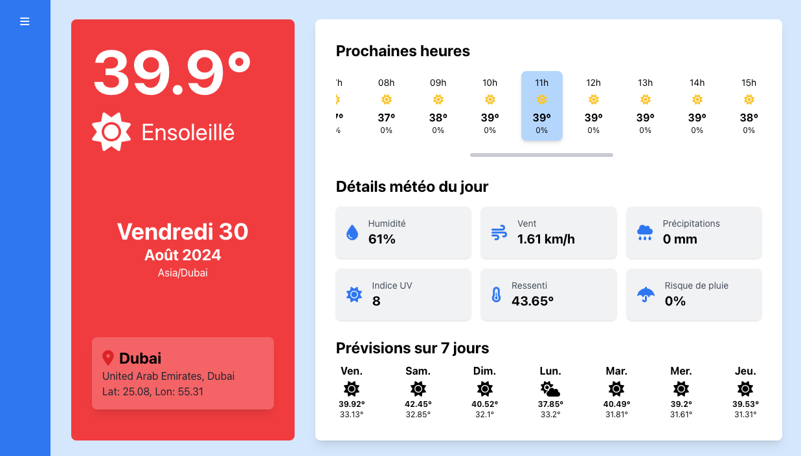
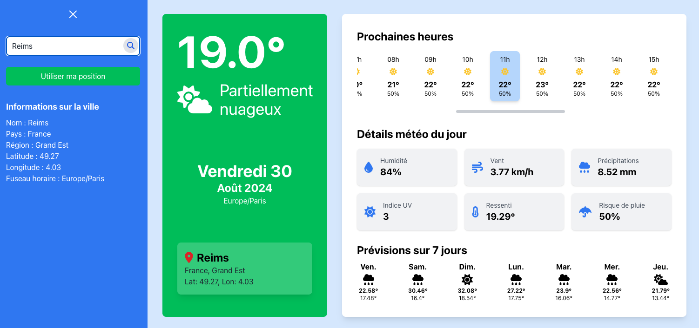

# 🌦️ Application Météo React

## 🎯 Objectif du projet

Cette application météo moderne et intuitive permet aux utilisateurs de consulter les prévisions météorologiques pour n'importe quelle ville dans le monde. Elle offre des informations détaillées sur les conditions météorologiques actuelles et les prévisions à court terme.

## 🖼️ Aperçu de l'application

*Vue principale de l'application météo*

*Interface de recherche de ville*

*Affichage des prévisions détaillées*

## 🛠️ Stack technique

- **React**: Bibliothèque JavaScript pour la construction de l'interface utilisateur
- **TypeScript**: Superset typé de JavaScript pour un développement plus robuste
- **Tailwind CSS**: Framework CSS utilitaire pour un design rapide et personnalisable
- **Font Awesome**: Bibliothèque d'icônes pour une interface utilisateur attrayante

## 🔍 Fonctionnalités principales

### Recherche de ville
L'application utilise l'API de Meteoblue pour permettre aux utilisateurs de rechercher une ville. Cette API renvoie les coordonnées géographiques de la ville sélectionnée.

https://www.meteoblue.com/en/server/search/query3?query=${encodeURIComponent(cityName)}&apikey={API_Key}

### Données météorologiques
Une fois la ville sélectionnée, l'application fait appel à l'API météo de Meteoblue pour récupérer les informations météorologiques détaillées.

https://my.meteoblue.com/packages/basic-day_current_clouds-day_sunmoon?apikey={API_Key}&lat=${lat}&lon=${lon}&asl=108&format=json&forecast_days=7;

## 🚀 Comment démarrer

1. Clonez ce dépôt
2. Installez les dépendances avec `npm install`
3. Lancez l'application en mode développement avec `npm start`
4. Ouvrez [http://localhost:3000](http://localhost:3000) pour voir l'application dans votre navigateur

## 📚 Pour en savoir plus

Pour approfondir vos connaissances sur React, consultez la [documentation React](https://reactjs.org/).

## 🤝 Contribution

Les contributions à ce projet sont les bienvenues. N'hésitez pas à ouvrir une issue ou à soumettre une pull request.

## 📄 Licence

Ce projet est sous licence MIT. Voir le fichier [LICENSE](LICENSE) pour plus de détails.

